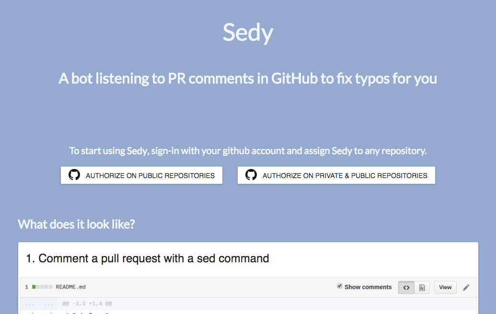

# What's Sedy
Sedy is a GitHub webhook which allows pull-request reviewers to fixes typos themselves by typing sed-like commands on review comments.

### How it works
After installing Sedy on your repository, just type a sed-like command (`s/[old text]/[new text]/`) in a single comment or in a code review, and Sedy will quickly commit the fix.

# Installation

### On your repositories
Log into the [Sedy Installer](https://marmelab.com/sedy/) with your GitHub account and click on your repositories.

### On your repositories (manually)

- Add a webhook to your repository with these informations:

| Input     | Value                          |
|-----------|--------------------------------|
|Payload URL| https://sedy.marmelab.com      |
|Scopes     | `Pull request review comment`  |

- Invite [sedy-bot](https://github.com/sedy-bot) user as a collaborator.

That's it.

### On all repositories of your organization
Sedy is not available on GitHub organizations yet.
If you are interested to help, please contact [marmelab](https://marmelab.com) for any request.

# Contributing
Whether it's for a bug or a suggestion, your feedback is precious. Feel free to [fill an issue](https://github.com/marmelab/sedy/issues/new). Be sure that it will be considered.

If you want to open a PR, all you need to know is written on the [CONTRIBUTING.md](./CONTRIBUTING.md).

# License
[sedy](https://marmelab.com/sedy/) is licensed under the [MIT License](./LICENSE), and sponsored by [marmelab](https://marmelab.com).
